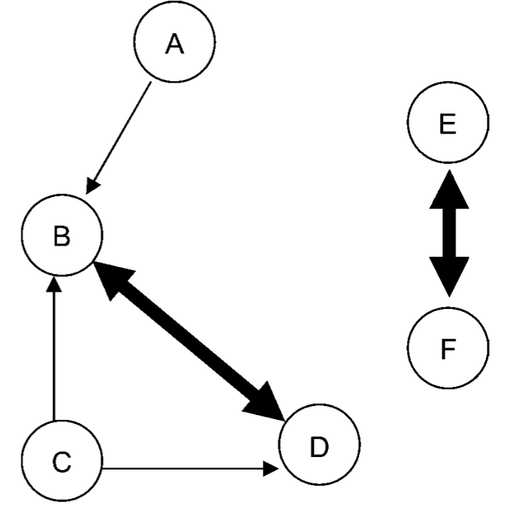

# Directed Relation Graph (DRG) for reduction of chemical kinetic mechanisms

The Directed Relation Graph (DRG) is an approach developed by Tianfeng Lu and Chung K. Law (2005) [1], for obtention of a skeletal mechanism. This method involves mapping coupling relations between chemical species into a directed graph, as depicted in Figure 1.

*Figure 1: A directed relation graph showing typical relations of the species. Source: Tianfeng Lu and Chung K. Law (2005) [1].*

Each node in the DRG represents a species in the detailed kinetic mechanism. If the removal of species B affects the production rate of species A, an edge is drawn from vertex A to vertex B (\( A \rightarrow B \)). An edge from A to B means that B has to be kept in the skeletal mechanism to correctly evaluate the production rate of A.

To quantify the influence between the species, \( r_{AB} \) is defined as follows:

\[
r_{AB} = \frac{\sum^{N_{reaction}}_{i=1} \ \big| \ v_{ji} \ q_{i} \ \delta_{Bi} \ \big|}{\sum^{N_{reaction}}_{i=1} \ \big| \ v_{ji} \ q_{i} \ \big|}
\]

\[
\delta_{Bi} =
\begin{cases}
    1, & \text{if the \( i\text{-th} \) reaction involves species B,}\\
    0, & \text{otherwise}
\end{cases}
\]

The dependence of A and B is later evaluated by the definition of a *threshold value* \( \varepsilon \). Then, the following rules are applied:

1. If \( r_{AB} < \varepsilon \), the dependence is negligible and there is no edge from A to B.
2. If \( r_{AB} \geq \varepsilon \), A depends on species B, and there is a directed edge from A to B.

A pivotal initial step in this approach is the selection of the *starting set* of species, which need to be kept in the mechanism. Subsequently, for each starting species, a Depth-First Search (DFS) is applied to the graph to delineate its dependent set. By initiating this graph search from specific target species (e.g., fuel, oxidizer, key pollutants), unreached species are deemed unimportant and subsequently eliminated from the skeletal mechanism (NIEMEYER, K.; SUNG, C.-J., 2011) [2].

The skeletal mechanism materializes through the union of these dependent sets, with the additional refinement with the elimination of all elementary reactions that do not contain any species in the skeletal mechanism (LU, T.; LAW, Chung K., 2005) [1].

## References

1. LU, Tianfeng; LAW, Chung K. A directed relation graph method for mechanism
reduction. Proceedings of the Combustion Institute, Elsevier Ltd, v. 30,
p. 1333–1341, 1 2005. ISSN 15407489.
2. NIEMEYER, Kyle; SUNG, Chih-Jen. DRGEP-based mechanism reduction strategies:
graph search algorithms and skeletal primary reference fuel mechanisms. In: 49TH
AIAA Aerospace Sciences Meeting including the New Horizons Forum and Aerospace
Exposition. [S.l.: s.n.], 2011. P. 508.

